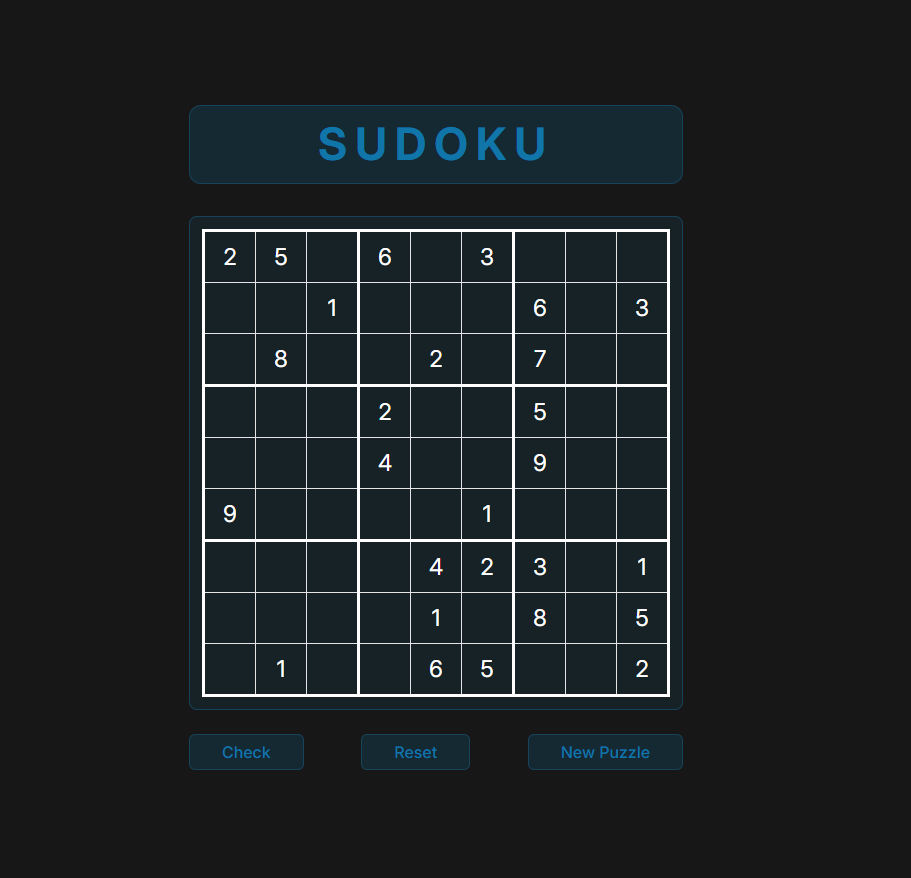

# Loje Sudoku - React JS

---

## Përmbledhje

Lojë Sudoku me funksione të plota në React, duke përfshirë:

-   Marrjen e te dhenave nga një API
-   Paraqitjen e tabeles Sudoku
-   Lejimin e përdoruesve për të futur numra
-   Kontrollin e saktësisë / validimin
-   Animacionet e fitores / reagimet e përdoruesit

---

## Konfigurimi dhe Arkitektura e Projektit

### 1. Skela e Projektit

-   Filloni një projekt të ri React (nëpërmjet `create-react-app` ose të ngjashme)
-   Instaloni varësi shtesë nëse është e nevojshme (marrje, stilim, animacione)
-   Struktura e sugjeruar e dosjeve:

-   -   /src
        -   /components
    -                   - Board.jsx
    -                   - Cell.jsx
    -                   - Controls.jsx
    -   /api
    -                   - fetchPuzzle.js
    -   App.jsx
    -   index.jsx
    -   styles.css (ose module)

-   `fetchPuzzle.js` permban funksione per te mare te dhena nga API

---
